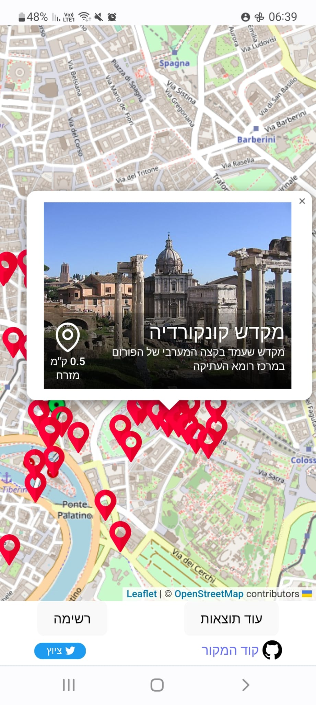

# Wiki Location

Displays wikipedia articles based on your current location (currently in hebrew)

<p align="center">

</p>


[See it live](https://noam-honig.github.io/wikiloc/)

## Run the code locally
1. Clone the repo
2. ```sh
   npm i
   npm run dev
   ```